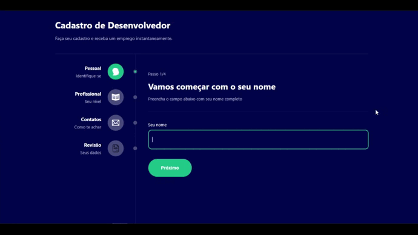

# Multi-Step Form

## | About

This is a Multi-Step Form made during my React journey, I've used most of the things I've been learning in this project.

## | Overview

## | Made Using
<ul>
<li>ReactJS</li>
<li>Typescript</li>
<li>Styled-Components</li>
<li>ContextAPI</li>
<li>React Router</li>
</ul>

## | How to Run

Make sure "Git" is installed in your PC!

    git clone https://github.com/Bruno-Messias-B-S/Multi-Step-Form.git

### Install
- `npm install`

### To run
- `npm start`

## | Made By
[Bruno Messias](https://www.linkedin.com/in/bruno-messias-bs/)